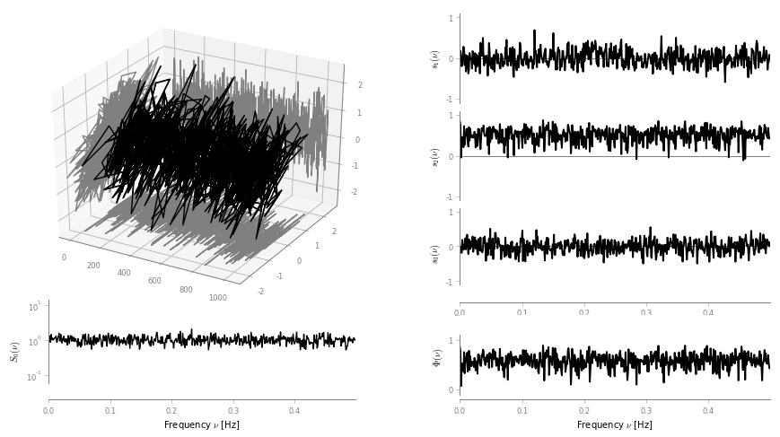
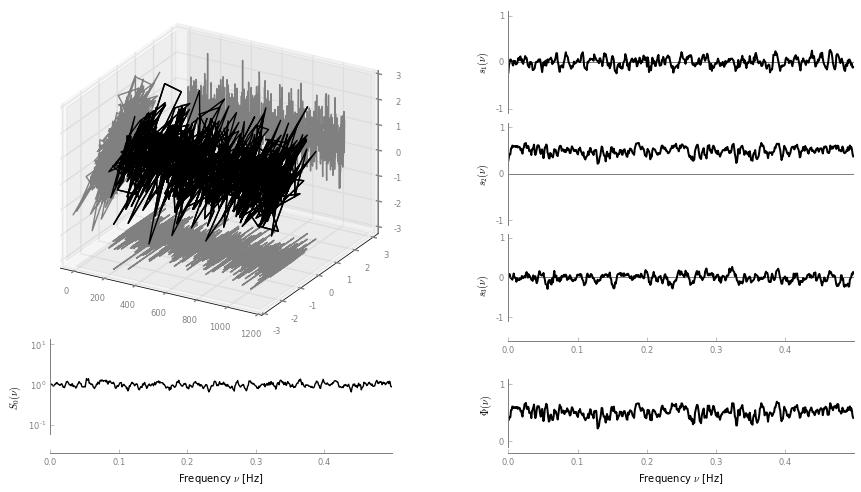
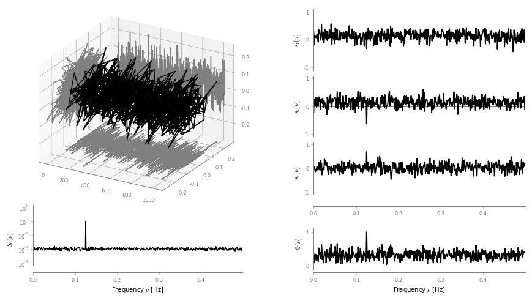
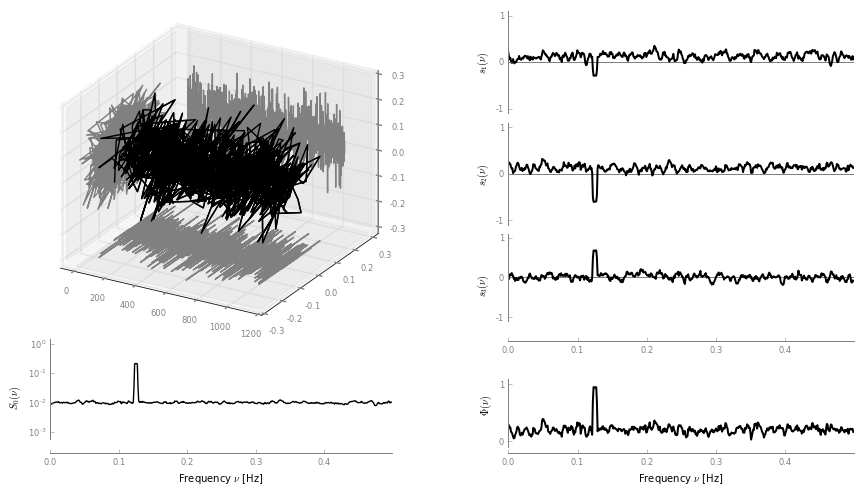
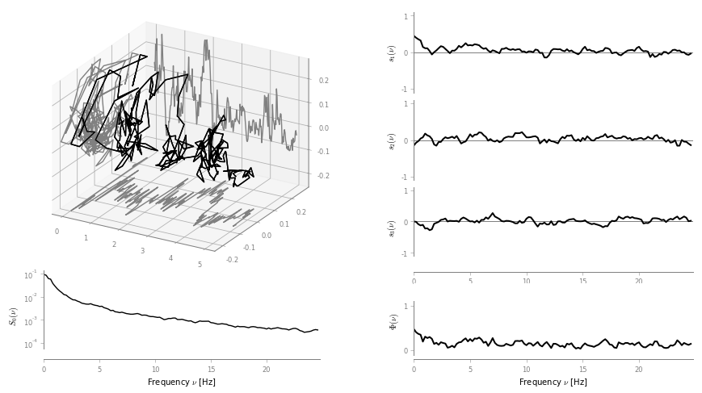
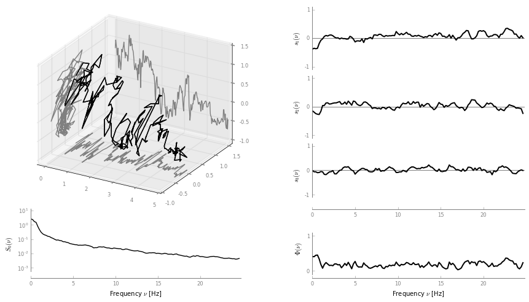
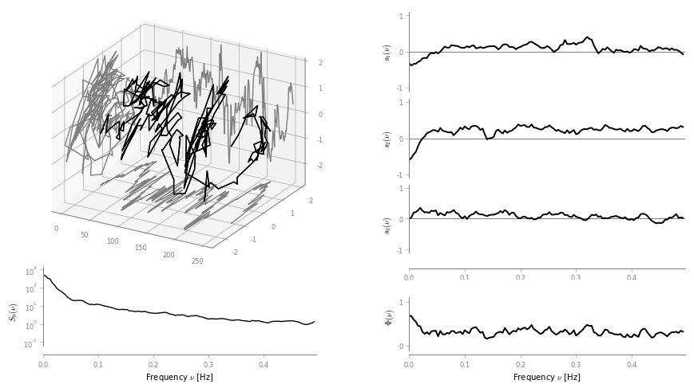

Spectral analysis of bivariate signals: tutorial
================================================

This tutorial aims at demonstrating different tools available within the
``spectral`` module of ``BiSPy``. The examples provided here come along
with the paper

-  Julien Flamant, Nicolas Le Bihan, Pierre Chainais: “Spectral analysis
   of stationary random bivariate signals”, IEEE Transaction on Signal
   Processing, 2017;
   `arXiv:1703.06417 <http://arxiv.org/abs/1703.06417>`__,
   `doi:10.1109/TSP.2017.2736494 <https://doi.org/10.1109/TSP.2017.2736494>`__

The paper contains theoretical results and several applications that can
be reproduced with the following tutorial. A completementary notebook
version is available
`here <https://github.com/jflamant/bispy/blob/master/notebooks/spectralanalysisTutorial.ipynb>`__.

Load ``bispy`` and necessary modules
------------------------------------

.. code:: ipython3

    import numpy as np
    import matplotlib.pyplot as plt
    import quaternion  # load the quaternion module
    import bispy as bsp

Synthetic examples
------------------

The following examples are presented in the aforementioned paper. The
module ``bispy.signals`` gives useful functions to generate the synthetic
signals presented.

Example 1: Bivariate white noise only
~~~~~~~~~~~~~~~~~~~~~~~~~~~~~~~~~~~~~

First let us define the constants defining the polarization properties
of the bivariate white gaussian noise.

.. code:: ipython3

    N = 1024 # length of the signal
    S0 = 1 # power of the bivariate WGN
    P0 = .5 # degree of polarization
    theta0 = np.pi/4 # angle of linear polarization

    t = np.arange(0, N) # time vector

First simulate a realization of this bivariate WGN:

.. code:: ipython3

    w = bsp.signals.bivariatewhiteNoise(N, S0, P=P0, theta=theta0)

Now, display this signal

.. code:: ipython3

    fig, ax = bsp.utils.visual.plot2D(t, w)

.. image:: spectralanalysisTutorial_files/output_9_0.png

The goal is now to compare 2 spectral density estimation methods:

-  an averaged polarization periodogram
-  an averaged multitaper estimate using Slepian tapers.

To do so, we simulate ``M`` independent realization of this bivariate
WGN, and average across realizations each method output.

.. code:: ipython3

    M = 10 # number of independent realization of the WGN

The periodogram and multitaper estimates are computed like:

.. code:: ipython3

    w = bsp.signals.bivariatewhiteNoise(N, S0, P=P0, theta=theta0)
    # compute spectral estimates
    per = bsp.spectral.Periodogram(t, w)
    multi = bsp.spectral.Multitaper(t, w)

    # loop accros realizations
    for k in range(1, M):
        w = bsp.signals.bivariatewhiteNoise(N, S0,  P=P0, theta=theta0)

        per2 = bsp.spectral.Periodogram(t, w)
        multi2 = bsp.spectral.Multitaper(t, w)
        per = per + per2
        multi = multi + multi2

    # normalize by M
    per = 1./M * per
    multi = 1./M * multi

By default, the ``Multitaper`` class assumes a bandwidth ``bw`` of 2.5
frequency samples, giving 4 Slepian tapers.

The next step is to normalize the Stokes parameters
:math:`S_1, S_2, S_3` by the intensity Stokes parameter :math:`S_0`

.. code:: ipython3

    per.normalize()
    multi.normalize()

We can now display the results for both methods

.. code:: ipython3

    fig, axes = per.plot()

.. code:: ipython3

    fig, ax = multi.plot()

Both estimates permit to recover the main features of the bivariate WGN:
power, degree of polarization and polarization state are recovered.

Then the usual discussion between periodogram and multitaper estimates
apply: the multitaper estimate exhibits reduced leakage bias and less
variance than the periodogram estimate.

Example 2: bivariate monochromatic signal in white noise
~~~~~~~~~~~~~~~~~~~~~~~~~~~~~~~~~~~~~~~~~~~~~~~~~~~~~~~~

We proceed similarly. First define the different parameters:

.. code:: ipython3

    N = 1024 # length of the signal

    t = np.arange(0, N) # time vector
    dt = (t[1]-t[0])

    # bivariate monochromatic signal parameters
    a = 1/np.sqrt(N*dt) # amplitude = 1
    theta = -np.pi/3 # polarization angle
    chi = np.pi/8 # ellipticity parameter
    f0 = 128/N/dt # frequency

    # bivariate WGN noise paramerters
    S0_w = 10**(-2) # power of the bivariate WGN
    Phi_w = .2 # degree of polarization
    theta_w = np.pi/8 # angle of linear polarization

Now, simulate a bivariate monochromatic signal (note the use of the
argument ``complexOutput`` which provides a complex output (useful for
plots), rather than a quaternion-valued output (useful for computations)

.. code:: ipython3

    x = bsp.signals.bivariateAMFM(a, theta, chi, 2*np.pi*f0*t)

Let us have a look at the bivariate signal itself

.. code:: ipython3

    fig, ax = bsp.utils.visual.plot2D(t, x)

.. image:: spectralanalysisTutorial_files/output_25_0.png

Again, we compare 2 spectral density estimation methods:

-  an averaged polarization periodogram
-  an averaged multitaper estimate using Slepian tapers.

To do so, we simulate ``M`` independent realization of this bivariate
WGN, and average across realizations each method output.

.. code:: ipython3

    M = 20 # number of realizations
    y = np.zeros((N, M), dtype='quaternion')

    # generate the data
    for k in range(M):
        phi = 2*np.pi*np.random.rand() # random initial phase term
        x = bsp.signals.bivariateAMFM(a, theta, chi, 2*np.pi*f0*t+phi) # bivariate monochromatic signal
        w = bsp.signals.bivariatewhiteNoise(N, S0_w, Phi_w, theta_w) # bivariate WGN
        y[:, k] = x + w

    # compute spectral estimates
    per = bsp.spectral.Periodogram(t, y[:, 0])
    multi = bsp.spectral.Multitaper(t, y[:, 0], bw=3)
    for k in range(1, M):
        per2 = bsp.spectral.Periodogram(t, y[:, k])
        multi2 = bsp.spectral.Multitaper(t, y[:, k], bw=3)

        per = per + per2
        multi = multi + multi2

    per = 1./M * per
    multi = 1/M * multi

Here the multitaper class is computed with a bandwidth ``bw = 3``
frequency samples, giving 5 Slepian tapers.

The next step is to normalize the Stokes parameters
:math:`S_1, S_2, S_3` by the intensity Stokes parameter :math:`S_0`

.. code:: ipython3

    per.normalize()
    multi.normalize()

We can now display the results for both methods

.. code:: ipython3

    fig, ax = per.plot()

.. code:: ipython3

    fig, ax = multi.plot()

A real case example: spectral analysis of wind measurements
-----------------------------------------------------------

We turn to a real-life example to illustrate the general relevance of
the method.

We consider a dataset of instantaneous wind measurements (east and
northward velocities). The dataset is available for download at
http://www.commsp.ee.ic.ac.uk/~mandic/research/WL\_Complex\_Stuff.htm.
This dataset has been used by the authors in several publications, e.g.
in

::

       S. L. Goh, M. Chen, D. H. Popovic, K. Aihara, D. Obradovic and D. P. Mandic, "Complex-Valued Forecasting of Wind Profile," Renewable Energy, vol. 31, pp. 1733-1750, 2006.

Quoting the included Readme: >- Wind data for 'low', 'medium' and 'high'
dynamics regions. - Data are recorded using the Gill Instruments
WindMaster, the 2D ultrasonic anemometer - Wind was sampled at 32 Hz and
resampled at 50Hz, and the two channels correspond to the the "north"
and "east" direction - To make a complex-valued wind signal, combine
z=v\_n + j v\_e, where 'v' is wind speed and 'n' and 'e' the north and
east directions - Data length = 5000 samples

Setting 1: low-wind
~~~~~~~~~~~~~~~~~~~

We start by loading the data

.. code:: ipython3

    import scipy.io as scio
    windData = scio.loadmat('datasets/wind/low-wind.mat')

    u = windData['v_east'][:,0]
    v = windData['v_north'][:, 0]

    N = np.size(u) # should be 5000
    dt = 1./50

Estimating polarization features in bivariate signals requires ideally
multiple measurements/realizations. We will fake this out using an
ergodic hypothesis. This thus split the signal into ``Nw`` subsignals,
and compute for each a spectral estimate. By averaging out spectral
estimates, one obtains a estimate of the spectral density of the
underlying process. (Welch method with no overlap)

Let's define a handy function:

.. code:: ipython3

    def subsignal(u, v, Nx, k):
        '''subsamples u, v components and returns the associated quaternion signal'''
        uk = u[k*Nx:(k+1)*Nx]
        vk = v[k*Nx:(k+1)*Nx]

        # to make it zero-mean
        uk = uk - np.mean(uk)
        vk = vk - np.mean(vk)

        return bsp.utils.sympSynth(uk, vk)

Then we compute the averaged multitaper estimate

.. code:: ipython3

    # subsampling parameters
    Nw = 20 # number of subsamples
    Nx = N // Nw # length of one subsampled signal

    # time index for subsampled signals
    tx = np.arange(Nx)*dt

    xk = subsignal(u, v, Nx, 0)

    multi = bsp.spectral.Multitaper(tx, xk)
    # loop across subsamples
    for k in range(1, Nw):

        xk = subsignal(u, v, Nx, k)
        multi2 = bsp.spectral.Multitaper(tx, xk)
        multi = multi + multi2

    # normalize and plot multitaper estimate
    multi.normalize()
    fig, ax = multi.plot()

The total power spectrum :math:`S_0(\nu)` exhibits a power-law like
shape.

Looking at the degree of polarization :math:`\Phi(\nu)`, we see that the
signal is almost unpolarized at all frequencies, except for frequencies
below 0.5 Hz, where we notice a small increase in the degree of
polarization.

Setting 2: moderate wind
~~~~~~~~~~~~~~~~~~~~~~~~

We follow the same procedure as above.

.. code:: ipython3

    # load data
    windData = scio.loadmat('datasets/wind/medium-wind.mat')

    u = windData['v_east'][:,0]
    v = windData['v_north'][:, 0]

    N = np.size(u)

    # we use an ergodic argument and split the signal into "sub-signals"
    Nw = 20
    Nx = N // Nw
    tx = np.arange(Nx)*dt

    xk = subsignal(u, v, Nx, 0)

    # compute spectral estimate
    multi = bsp.spectral.Multitaper(tx, xk)
    for k in range(1, Nw):

        xk = subsignal(u, v, Nx, k)
        multi2 = bsp.spectral.Multitaper(tx, xk)

        multi = multi + multi2

    # normalize and plot multitaper estimate
    multi.normalize()
    fig, ax = multi.plot()

We observe again power law - like shape in the total power
:math:`S_0(\nu)`. The degree of polarization :math:`\Phi(\nu)` is close
to zero for frequencies above 1 Hz; There is again a small "step" for
frequencies below 1 Hz.

Setting 3: high-wind
~~~~~~~~~~~~~~~~~~~~

Again, same procedure.

.. code:: ipython3

    # load data
    windData = scio.loadmat('datasets/wind/high-wind.mat')

    u = windData['v_east'][:,0]
    v = windData['v_north'][:, 0]

    N = np.size(u)

    # we use an ergodic argument and split the signal into "sub-signals"
    Nw = 20
    Nx = N // Nw
    tx = np.arange(Nx)

    xk = subsignal(u, v, Nx, 0)

    # compute spectral estimate
    multi = bsp.spectral.Multitaper(tx, xk)
    for k in range(1, Nw):

        xk = subsignal(u, v, Nx, k)
        multi2 = bsp.spectral.Multitaper(tx, xk)

        multi = multi + multi2
    # normalize and plot multitaper estimate
    multi.normalize()
    fig, ax = multi.plot()

Again :math:`S_0(\nu)` exhibits a power law shape. The degree of
polarization is overall higher than in the low and moderate wind
settings. The signal is strongly polarized (:math:`\Phi(0) \simeq 0.7`)
at low frequencies. High frequencies show a relatively constant degree
of polarization, around :math:`\Phi(\nu) \simeq 0.3`
