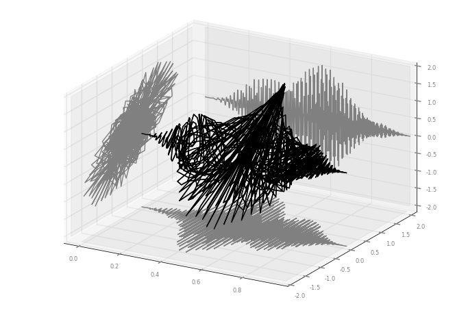
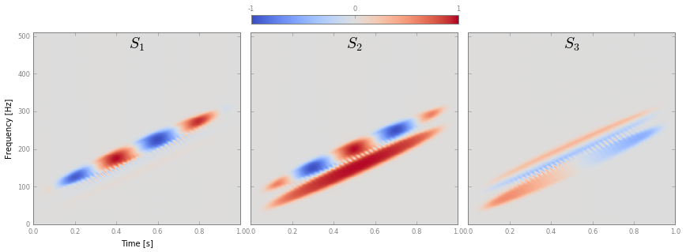
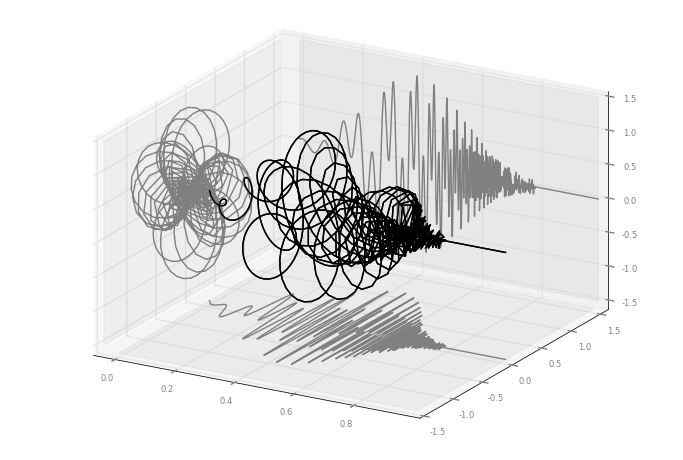
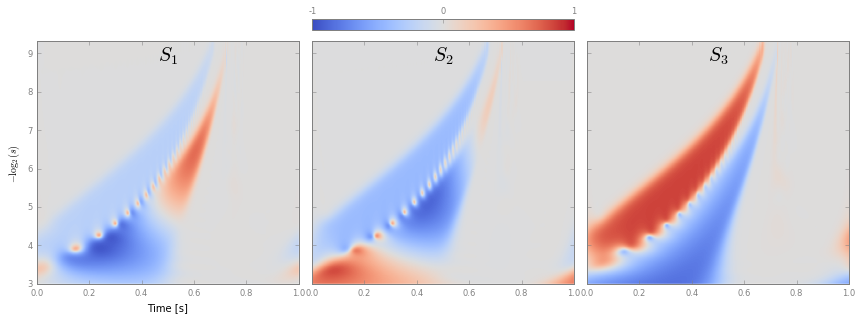
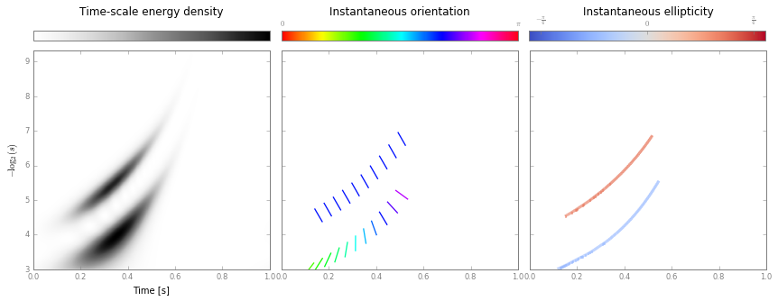

Time-Frequency-Polarization analysis: tutorial
=================================================================================

This tutorial aims at demonstrating different tools available within the
``timefrequency`` module of ``BiSPy``. The examples provided here come
along with the paper

-  Julien Flamant, Nicolas Le Bihan, Pierre Chainais: “Time-frequency
   analysis of bivariate signals”, 2016;
   `arXiv:1609.0246 <http://arxiv.org/abs/1609.02463>`_ .

The paper contains theoretical results and several applications that can
be reproduced with the following tutorial. If you use ``BiSPy`` for
your research, please kindly cite the above paper as reference.

Load ``BiSPy`` and necessary modules
~~~~~~~~~~~~~~~~~~~~~~~~~~~~~~~~~~~~~~
The code below can be executed, for instance, in a Jupyter Notebook. 

.. code:: python

    %pylab inline
    import quaternion  # load the quaternion module

    # if BiSPy is not located in your python module directory
    # import sys
    # sys.path.append('/BiSPy_location_path/')
    import BiSPy as bsp

Quaternion Short-Term Fourier Transform (Q-STFT) example
~~~~~~~~~~~~~~~~~~~~~~~~~~~~~~~~~~~~~~~~~~~~~~~~~~~~~~~~

To illustrate the behaviour of the Q-STFT, we construct a simple signal
made of two linear chirps, each having its own instantaneous
polarization properties.

First, define some constants:

.. code:: python

    N = 1024 # length of the signal
    
    # linear chirps constants
    a = 250*pi
    b = 50*pi
    c = 150*pi

Then define the instantaneous amplitudes, orientation, ellipticity and
phase of each linear chirp. The amplitudes are taken equal - just a
Hanning window.

.. code:: python

    # time vector
    t = np.linspace(0, 1, N)
    
    # first chirp
    theta1 = pi/4 # constant orientation
    chi1 = pi/6-t # reversing ellipticity
    phi1 = b*t+a*t**2 # linear chirp
    
    # second chirp
    theta2 = pi/4*10*t # rotating orientation
    chi2 = 0 # constant null ellipticity
    phi2 = c*t+a*t**2 # linear chirp
    
    # common amplitude -- simply a window
    env = bsp.utils.windows.hanning(N)

We can now construct the two components and sum it. To do so, we use the
function ``utils.bivariateAMFM`` to compute directly the quaternion
embeddings of each linear chirp.

.. code:: python

    # define chirps x1 and x2
    x1 = bsp.utils.bivariateAMFM(env, theta1, chi1, phi1)
    x2 = bsp.utils.bivariateAMFM(env, theta2, chi2, phi2)
    
    # sum it
    x = x1 + x2

Let us have a look at the signal x[t]

.. code:: python

    fig, ax = bsp.utils.visual.plot3D(t, x)

Now we can compute the Q-STFT. First define a window and spacing to use
(window length should be odd):

.. code:: python

    window = bsp.utils.windows.hanning(101)
    spacing = 1

Construct the Q-STFT object from the ``timefrequency`` module

.. code:: python

    S = bsp.timefrequency.QSTFT(t, x, window, spacing)

.. parsed-literal::

    Computing Q-STFT coefficients
    Computing Time-Frequency Stokes parameters

Let us have a look at Time-Frequency Stokes parameters S1, S2 and S3

.. code:: python

    fig, ax = S.plotStokes()

Alternatively, we can compute the instantaneous polarization properties
from the ridges of the Q-STFT.

Extract the ridges:

.. code:: python

    S.extractRidges()

.. parsed-literal::

    Extracting ridges
    Ridge added
    Ridge added
    2 ridges were recovered.

And plot (quivertdecim controls the time-decimation of the quiver
plot, for a cleaner view):

.. code:: python

    fig, ax = S.plotRidges(quivertdecim=30)

.. image:: timefrequencyTutorial_files/timefrequencyTutorial_21_0.png

The two representations are equivalent and provide the same information:
time, frequency and polarization properties of the bivariate signal. A
direct inspection shows that instantaneous parameters of each components
are recovered by both representations.

Quaternion Continuous Wavelet Transform (Q-CWT) example
~~~~~~~~~~~~~~~~~~~~~~~~~~~~~~~~~~~~~~~~~~~~~~~~~~~~~~~

The Q-STFT method has the same limitations as the usual STFT, that is
not the ideal tool to analyze signals spanning a wide range of
frequencies over short time scales. We revisit here the classic two
chirps example in its bivariate (polarized) version.

As before, let us first define some constants:

.. code:: python

    N = 1024 # length of the signal
    
    # hyperbolic chirps parameters
    alpha = 15*pi
    beta = 5*pi
    tup = 0.8 # set blow-up time value

Now, let us define the instantaneous amplitudes, orientation,
ellipticity and phase of each linear chirp. The chirps are also
windowed.

.. code:: python

    t = np.linspace(0, 1, N) # time vector
    
    # chirp 1 parameters
    theta1 = -pi/3 # constant orientation
    chi1 = pi/6 # constant ellipticity
    phi1 = alpha/(.8-t) # hyperbolic chirp
    
    # chirp 2 parameters
    theta2 = 5*t # rotating orientation
    chi2 = -pi/10 # constant ellipticity
    phi2 = beta/(.8-t) # hyperbolic chirp
    
    # envelope
    env = np.zeros(N)
    Nmax = int(0.79*N) # maximum value of N such that x is nonzero
    env[:Nmax] = bsp.utils.windows.hamming(Nmax)

Construct the two components and sum it. Again we use the function
``utils.bivariateAMFM`` to compute directly the quaternion embeddings of
each linear chirp.

.. code:: python

    x1  = bsp.utils.bivariateAMFM(env, theta1, chi1, phi1)
    x2  = bsp.utils.bivariateAMFM(.8 * env, theta2, chi2, phi2)
    
    x = x1 + x2

Let us visualize the resulting signal x[t]

.. code:: python

    fig, ax = bsp.utils.visual.plot3D(t, x)

Now, we can compute its Q-CWT. Note that for now, only the Morlet
wavelet is implemented. We compute the Q-CWT of x[t] on N
scales.

.. code:: python

    S = bsp.timefrequency.QCWT(t, x, wave='Morlet', Nscale=N)

.. parsed-literal::

    Computing Q-CWT
    Computing Time-Scale Stokes parameters

Let us have a look at Time-Scale Stokes parameters S1, S2 and S3

.. code:: python

    fig, ax = S.plotStokes()

Similarly we can compute the instantaneous polarization attributes from
the ridges of the Q-CWT.

.. code:: python

    S.extractRidges()

.. parsed-literal::

    Extracting ridges
    Ridge added
    Ridge added
    2 ridges were recovered.

And plot the results

.. code:: python

    fig, ax = S.plotRidges(quivertdecim=40)

Again, both representations are equivalent and provide the same
information: time, scale and polarization properties of the bivariate
signal. A direct inspection shows that instantaneous parameters of each
components are recovered by both representations.
